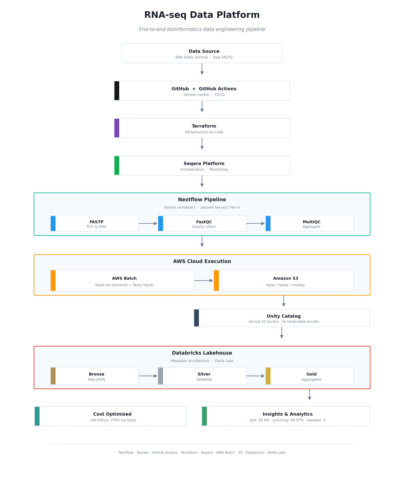

Readme final · MD
# RNA-seq Quality Control Data Platform
 
An end-to-end bioinformatics data engineering platform that processes RNA sequencing data through a containerized pipeline, orchestrates execution on AWS cloud infrastructure, and delivers analytics-ready insights via a Databricks lakehouse.
 

 
## Overview
 
This project takes raw RNA sequencing data from a public archive, runs it through a quality-control pipeline, executes it at scale on AWS, and transforms the resulting metrics into analytics-ready tables using a Medallion architecture in Databricks. Every layer is automated, reproducible, and cost-optimized.
 
## Architecture
 
```
Raw FASTQ (ENA)
      |
Nextflow Pipeline  (FASTP -> FastQC -> MultiQC)   [Docker containers]
      |
GitHub Actions CI/CD   [automated testing on every push]
      |
Seqera Platform   [orchestration & monitoring]
      |
AWS Batch   [parallel cloud execution]
      |
Amazon S3   [results storage]
      |
Databricks Lakehouse   [Bronze -> Silver -> Gold]
      |
Analytics-ready insights
```
 
## Technology Stack
 
| Layer | Technology | Purpose |
|-------|-----------|---------|
| Workflow | Nextflow (DSL2) | Pipeline orchestration |
| Containers | Docker | Reproducible tool environments |
| CI/CD | GitHub Actions | Automated testing on every push |
| Monitoring | Seqera Platform | Real-time execution dashboard |
| Compute | AWS Batch | Scalable cloud execution |
| Storage | Amazon S3 | Persistent results storage |
| IaC | Terraform | Infrastructure provisioning |
| Analytics | Databricks | Lakehouse & Medallion architecture |
| Data Format | Delta Lake | ACID-compliant storage |
| Access Control | Unity Catalog | Secure credential management |
 
## Pipeline Components
 
### Nextflow Pipeline
 
Three modular processes running in a fan-out / fan-in pattern, each in a pinned Docker container:
 
- **FASTP** — Trims low-quality bases and adapters from raw reads
- **FastQC** — Generates per-sample quality control reports
- **MultiQC** — Aggregates all sample reports into a single JSON summary
### Infrastructure (Terraform)
 
Provisions AWS resources declaratively: S3 bucket, AWS Batch compute environment (Spot instances for task jobs, on-demand for the head job), IAM roles with least-privilege access, and job queues.
 
### CI/CD (GitHub Actions)
 
Every code push triggers automated validation: generates synthetic test FASTQ data, runs the full pipeline locally, verifies expected outputs exist, and blocks the merge if tests fail.
 
### Databricks Medallion Architecture
 
Transforms raw metrics into analytics-ready data across three layers using PySpark and Delta Lake:
 
- **Bronze** — Raw ingestion of MultiQC JSON from S3 (immutable audit trail)
- **Silver** — Validated and cleaned metrics with quality gates applied
- **Gold** — Aggregated business summaries
Secure S3 access is configured through Unity Catalog (storage credential linked to an AWS IAM role, plus an external location) with no hardcoded credentials anywhere in the code.
 
## Getting Started
 
### Prerequisites
 
- Nextflow 24.04+
- Docker
- AWS account with configured credentials
- Terraform 1.5+
- Databricks workspace with Unity Catalog
### Run Locally
 
```bash
nextflow run main.nf \
  -profile docker \
  --input samplesheet.csv \
  --outdir results
```
 
### Run on AWS via Seqera
 
```bash
export TOWER_ACCESS_TOKEN=<your-token>
nextflow run main.nf -profile docker -with-tower
```
 
Launch parameters:
 
```json
{
  "input": "https://raw.githubusercontent.com/deshmukh22ant/rnaseq-qc-nextflow/main/samplesheet.csv",
  "outdir": "s3://your-bucket/results"
}
```
 
### Provision Infrastructure
 
```bash
cd rnaseq-infra
terraform init
terraform plan
terraform apply
```
 
## Repository Structure
 
```
rnaseq-qc/
├── main.nf                         # Workflow orchestration
├── nextflow.config                 # Pipeline configuration
├── samplesheet.csv                 # Input sample definitions
├── modules/
│   ├── fastp.nf                    # Trimming process
│   ├── fastqc.nf                   # QC process
│   └── multiqc.nf                  # Aggregation process
├── .github/workflows/
│   └── ci.yml                      # CI/CD pipeline
├── test-data/                      # Synthetic test data
├── rnaseq-infra/
│   └── main.tf                     # Terraform infrastructure
├── rnaseq-qc-medallion-pipeline/   # Databricks notebook
├── architecture-final.jpg          # Architecture diagram
└── README.md
```
 
## Key Engineering Decisions
 
**Spot instances for cost efficiency** — Task jobs run on Spot instances (up to 70% cheaper), while the stateful Nextflow head job uses on-demand instances for stability. Total cost per run is roughly $0.03 versus $0.12 for all on-demand — a 75% saving.
 
**Pinned container versions** — All tool containers use exact version tags for byte-for-byte reproducibility across local, CI, and cloud environments.
 
**Dynamic sample detection** — The Databricks pipeline auto-detects samples from the MultiQC output, scaling from 2 to thousands of samples without code changes.
 
**Infrastructure as code** — All AWS resources are provisioned via Terraform, making the infrastructure reproducible, version-controlled, and auditable.
 
**Secure credential management** — Databricks accesses S3 through Unity Catalog storage credentials and external locations, avoiding any hardcoded secrets in code or version control.
 
## Sample Results
 
The Gold layer produces aggregated quality metrics:
 
| Metric | Value | Description |
|--------|-------|-------------|
| avg_q30_quality | 92.9% | Average percentage of bases with Q30+ quality |
| avg_pct_surviving | 99.97% | Average percentage of reads surviving trimming |
| total_samples | 2 | Number of samples processed |
 
## Debugging Highlights
 
Real issues resolved during development, demonstrating end-to-end ownership:
 
- **Docker mount permission (exit 125)** — macOS Docker Desktop path restrictions; resolved by relocating the working directory.
- **Out-of-memory kills (exit 137)** — Parallel tasks exhausting RAM; resolved with per-process memory limits and concurrency caps.
- **FASTQ validation** — Test data with mismatched sequence/quality lengths; resolved with dynamic quality-string generation.
- **AWS Batch stuck RUNNABLE** — Head job requesting Spot instances; resolved by separating on-demand (head) and Spot (task) queues via Batch Forge.
- **S3 access from Databricks** — Configured Unity Catalog storage credential with a self-assuming IAM role and external location.
## License
 
MIT
 
